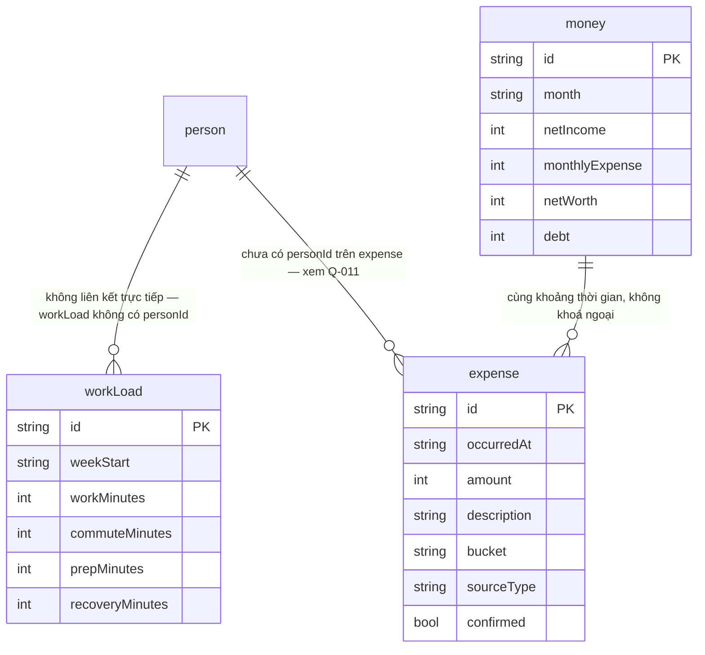

# Mô hình dữ liệu — V2

> Sinh bởi skill `phan-tich-yeu-cau`, 2026-08-25. Trích từ `docs/02-data-model.md` (S-003), đánh dấu phạm vi V2. Ba bảng thuộc V1 (`person`, `timeEntry`, `moment`) không lặp lại chi tiết ở đây — xem `docs/dac-ta/mo-hinh-du-lieu.md`.

## Ba bảng thuộc V2

### workLoad

Tải công việc theo tuần, một bản ghi mỗi tuần.

| Trường | Kiểu | Ghi chú |
|---|---|---|
| id | uuid v7 | |
| weekStart | date | |
| workMinutes | int | |
| commuteMinutes | int | |
| prepMinutes | int | |
| recoveryMinutes | int | |
| createdAt, updatedAt, deletedAt | timestamp | chuẩn chung R-052 |

Bốn trường phút cộng lại dùng trong `realWorkHours` (R-066). Đơn vị là **theo tuần** theo đúng tên bảng — điểm này là gốc của câu hỏi Q-010 về cách `code/fe/src/core/lifeRate.ts` gộp dữ liệu tuần thành tháng.

### money

Ảnh chụp tài chính, một bản ghi mỗi tháng.

| Trường | Kiểu | Ghi chú |
|---|---|---|
| id | uuid v7 | |
| month | text `YYYY-MM` | |
| netIncome | int VND | sau thuế và bảo hiểm (R-068) |
| monthlyExpense | int VND | |
| netWorth | int VND | tài sản thanh khoản trừ nợ ngắn hạn, không tính nhà/xe đang dùng (R-076) |
| debt | int VND | |
| createdAt, updatedAt, deletedAt | timestamp | |

Không có trường `monthlySaving` riêng trong schema — công thức `freedomDaysGained` và biên "netWorth âm" đều cần `monthlySaving` (S-004 dòng56, dòng63). Suy ra được bằng `netWorth` tháng này trừ `netWorth` tháng trước, nhưng không nguồn nào xác nhận đây là cách tính đúng — xem `docs/dac-ta/gia-dinh-v2.md` mã A-009.

### expense

Một khoản chi.

| Trường | Kiểu | Ghi chú |
|---|---|---|
| id | uuid v7 | |
| occurredAt | timestamp | |
| amount | int VND | |
| description | text | |
| bucket | enum? | 6 khoang giá trị, dùng chung enum với `timeEntry.bucket` (R-086) |
| sourceType | enum | `manual \| sms \| notification` |
| confirmed | bool | |
| createdAt, updatedAt, deletedAt | timestamp | |
| *(dẫn xuất, không lưu)* | | `hoursCost`, `freedomDaysCost` — tính theo R-083, R-084 |

## Trường đã có sẵn từ schema V1, dùng ở V2

`person.dunbarRing` (`5 \| 15 \| 50`) đã được viết sẵn trong schema từ V1 theo đúng nguyên tắc R-053 (viết đủ 13 bảng ngay từ đầu), nhưng chưa gán ý nghĩa nghiệp vụ nào cho tới UC-27 ở vòng này.

## Chỗ schema không đủ chỗ chứa cho M6 — phát hiện quan trọng nhất của mục này

R-053 (V1, vẫn còn hiệu lực) quy định: *"Schema viết đầy đủ 13 bảng ngay từ đầu, chỉ migration dần theo phiên bản, không thiết kế lại giữa chừng."* Đối chiếu 13 bảng đã liệt trong `docs/02-data-model.md` với năm tính năng của M6:

| Tính năng M6 | Có chỗ lưu trong 13 bảng không |
|---|---|
| Vòng tròn Dunbar | Có — `person.dunbarRing` |
| Nhật ký gặp gỡ 1 dòng | Có thể tái dùng `moment` (trường `text` + `personIds`), không chắc là thiết kế đúng — xem Q-018 |
| Nhiệt kế quan hệ | **Không có** — không bảng nào lưu một điểm số hay mức quan hệ theo thời gian cho từng `person` |
| Nhắc ngày quan trọng | **Không có** — `person` chỉ có `birthYear` (năm sinh), không có danh sách ngày quan trọng khác (kỷ niệm, ngày cưới...) |
| Gợi ý hẹn gặp | Không cần bảng riêng — tính từ `timeEntry` + `person.desiredCadence` đã có, nhưng cần thêm khái niệm "lịch trống" chưa có nguồn dữ liệu nào (xem Q-013) |

Hai ô "Không có" ở trên là mâu thuẫn trực tiếp với R-053: nếu M6 thật sự cần "nhiệt kế quan hệ" và "ngày quan trọng" như hai khái niệm dữ liệu riêng, schema 13 bảng hiện tại thiếu chỗ chứa, và bất kỳ cách thêm trường nào cũng là "thiết kế lại" mà R-053 nói không nên làm giữa chừng. Đưa thành câu hỏi mức Chặn, xem Q-018.

## ERD bổ sung — phạm vi V2

`workLoad` không có `personId` — hợp lý vì tải công việc là của chính Người dùng, không gắn với `person` nào khác. `expense` cũng không có `personId` trong `02-data-model.md`, nhưng Ví chung (R-089) cần biết khoản chi thuộc về ai trong "các bên" — không có cột nào biểu diễn việc này. Đây là hệ quả trực tiếp của câu hỏi Q-011 chưa trả lời, không phải một phát hiện tách biệt.
