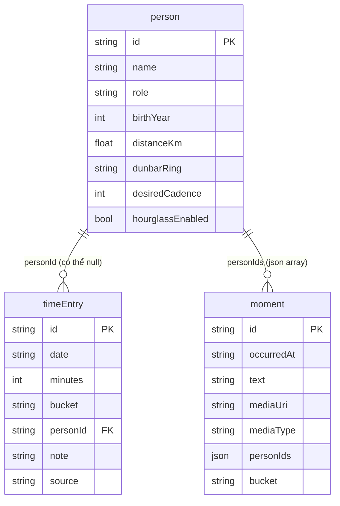

# Mô hình dữ liệu

> Sinh bởi skill `phan-tich-yeu-cau`, 2026-08-25. Trích từ `docs/02-data-model.md` (S-003), đánh dấu lại phạm vi theo phiên bản để phần V1 nổi rõ.

## Ba bảng thuộc V1

### person

Người quan trọng của người dùng.

| Trường | Kiểu | Ghi chú |
|---|---|---|
| id | uuid v7 | |
| name | text | |
| role | enum | `child \| parent \| partner \| friend \| self \| other` |
| birthYear | int? | bắt buộc nếu bật Đồng hồ cát cho người có vai trò `child` — xem Q-001, Q-008 |
| distanceKm | number? | dùng cho công thức bố mẹ ở xa |
| dunbarRing | enum | `5 \| 15 \| 50` — thuộc M6, chưa dùng ở V1, giữ cột theo R-053 |
| desiredCadence | int | số lần/tháng mong muốn, nhập ở UC-01 bước 3 |
| hourglassEnabled | bool | mặc định `false` (R-003) |
| createdAt, updatedAt, deletedAt | timestamp | chuẩn chung R-052 |

### timeEntry

Một khoảng thời gian đã dùng.

| Trường | Kiểu | Ghi chú |
|---|---|---|
| id | uuid v7 | |
| date | date | |
| minutes | int | không dùng giờ thập phân (R-010) |
| bucket | enum | `work \| health \| people \| learn \| rest \| self` |
| personId | uuid? | null nếu không với ai cụ thể — xem Q-001 cho trường hợp `bucket = 'self'` |
| note | text? | |
| source | enum | `manual \| calendar \| widget` |
| createdAt, updatedAt, deletedAt | timestamp | |

### moment

| Trường | Kiểu | Ghi chú |
|---|---|---|
| id | uuid v7 | |
| occurredAt | timestamp | |
| text | text? | |
| mediaUri | text? | |
| mediaType | enum? | `photo \| audio` |
| personIds | json array | |
| bucket | enum? | |
| createdAt, updatedAt, deletedAt | timestamp | |

## Mười bảng còn lại — viết schema đủ ngay, chưa dùng ở V1

Theo R-053, toàn bộ 13 bảng viết đủ từ đầu, chỉ bật dần theo phiên bản. Bảng dưới liệt các bảng không thuộc V1, giữ nguyên định nghĩa từ S-003 — không lặp lại chi tiết cột ở đây, xem trực tiếp `docs/02-data-model.md`.

| Bảng | Phiên bản bật | 
|---|---|
| workLoad | V2 — xem Q-002, có mâu thuẫn với cách liệt kê trong `01-modules.md` |
| money | V2 |
| expense | V2 |
| goal | V3 |
| space | V3 |
| letter | V4 |
| health | V4 |
| mood, weightOnMind, item | V5 |

## ERD — phạm vi V1

Quan hệ `moment.personIds` là mảng JSON, không phải khoá ngoại quan hệ chuẩn — một khoảnh khắc có thể gắn nhiều người cùng lúc (ví dụ ăn tối cả nhà). ERD vẽ nét đứt về mặt ý nghĩa dù ký hiệu mermaid không phân biệt được, ghi chú lại bằng chữ trên cạnh quan hệ.

## Sổ cái vốn sống (`capitalLedger`)

Không phải bảng, là view tổng hợp tính từ `timeEntry` + `moment` (+ `expense`, `person` khi tới V2). Ở phạm vi V1, chỉ có hai trục `time` và `people` được nạp dữ liệu thật (`money` và `feeling` cần `expense`/`mood` chưa bật). Không tách UC riêng cho `capitalLedger` ở V1 vì chưa có màn hình nào đọc nó — `01-modules.md` mục "Giao điểm giữa các module" toàn bộ là câu ví dụ cần dữ liệu tài chính, thuộc V2 trở đi.
